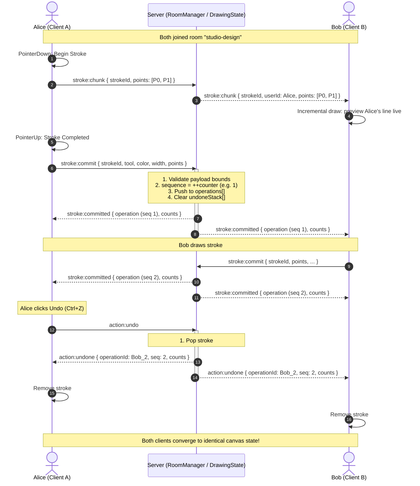

# System Architecture Documentation — CanvasFlow Studio

This document details the architectural foundation, data protocols, rendering pipeline, concurrency controls, and scalability profile of **CanvasFlow Studio**. It reflects the concrete implementation present in the codebase.

---

## 1. System Architecture

CanvasFlow Studio implements an **event-driven, client-server architecture with server-authoritative state**.

```
┌─────────────────────────────────────────────────────────────────────────────┐
│                            CLIENT WORKSPACE                                 │
│                                                                             │
│   ┌─────────────────────┐   ┌─────────────────────┐   ┌─────────────────┐   │
│   │    CanvasEngine     │   │     SocketClient    │   │CollaborativeApp │   │
│   │  - Pointer Capture  │   │  - Socket.IO Conns  │   │  - UI Controls  │   │
│   │  - DPR Calibration  │   │  - Point Batching   │   │  - Overlay Loop │   │
│   │  - Quadratic Curves │   │  - Cursor Throttle  │   │  - Shortcuts    │   │
│   │  - destination-out  │   │  - Reconnect Logic  │   │  - Toast System │   │
│   └──────────┬──────────┘   └──────────┬──────────┘   └────────┬────────┘   │
└──────────────┼─────────────────────────┼───────────────────────┼────────────┘
               │                         │                       │
               ▼                         ▼                       ▼
    [#canvas (2D Vector)]     [WebSocket / Socket.IO]   [#cursors-canvas (Overlay)]
                                         ▲
                                         │
┌────────────────────────────────────────┼────────────────────────────────────┐
│                                 NODE.JS BACKEND                             │
│                                                                             │
│   ┌─────────────────────────┐          │          ┌───────────────────────┐ │
│   │      Express Server     │◄─────────┴─────────►│    Socket.IO Server   │ │
│   │  - Static Client Files  │                     │  - Event Dispatcher   │ │
│   │  - /health Endpoint     │                     │  - Payload Validation │ │
│   │  - /room/:roomId Routes │                     │  - Max Buffer Limits  │ │
│   └─────────────────────────┘                     └───────────┬───────────┘ │
│                                                               │             │
│                                ┌──────────────────────────────┴──────────┐  │
│                                │             RoomManager                 │  │
│                                │   - Map<roomId, RoomState>              │  │
│                                │   - User Session Roster                 │  │
│                                │   - Idle Retention Timers               │  │
│                                └──────────────────────┬──────────────────┘  │
│                                                       │                     │
│                                ┌──────────────────────┴──────────────────┐  │
│                                │            DrawingState                 │  │
│                                │   - Monotonic Sequence Generator        │  │
│                                │   - Ordered operations[] Log            │  │
│                                │   - Global undoneStack[]                │  │
│                                │   - Memory Bounds (Max 2,000 Ops)       │  │
│                                └─────────────────────────────────────────┘  │
└─────────────────────────────────────────────────────────────────────────────┘
```

---

## 2. Client / Server Responsibilities

| Responsibility | Client Side | Server Side |
|---|---|---|
| **Input Capture** | Captures pointer events, coalesced events, calculates normalized coords | None (unaware of physical screen coordinates) |
| **Active Stroke Rendering** | Instant local 60fps quadratic curve preview | Forwards incremental chunks to room peers |
| **Authoritative Sequencing** | None (tentative local strokes) | Assigns monotonic sequence IDs upon commit |
| **History & Undo/Redo** | Replays vector strokes from local memory | Manages `operations[]` and `undoneStack[]` |
| **Sanitization & Security** | Validates user input ranges before emitting | Strictly validates types, lengths, bounds, colors |
| **Room Isolation** | Tracks single active `roomId` from URL | Partitions connections into isolated Socket.IO channels |
| **Cursor Presence** | Animates cursor canvas overlay at 60fps via RAF | Relays throttled `(x, y)` coordinates to room |
| **Persistence / Retention**| Stores active room vector list | Retains empty rooms for 10 minutes against refresh |

---

## 3. Data Flow Diagram

The following Mermaid sequence diagram illustrates the lifecycle of multi-user drawing, streaming, commit, and a global undo operation:



---

## 4. WebSocket Protocol Specification

All communication occurs over Socket.IO events within room channels.

### Client → Server Events

| Event | Payload Structure | Description |
|---|---|---|
| `room:join` | `{ roomId: string, userName?: string }` | Requests entry into a specific room. |
| `stroke:chunk` | `{ strokeId: string, tool: string, color: string, width: number, points: Point[] }` | Emits uncommitted points in real time (~25ms interval). |
| `stroke:commit` | `{ id: string, tool: 'brush'\|'eraser', color: string, width: number, points: Point[] }` | Submits finalized stroke for authoritative sequence assignment. |
| `action:undo` | *(empty)* | Requests global undo of the latest active stroke in the room. |
| `action:redo` | *(empty)* | Requests global redo of the latest undone stroke in the room. |
| `action:clear` | *(empty)* | Requests clearing all drawings in the room. |
| `cursor:move` | `{ x: number, y: number }` | Sends normalized cursor position (throttled to 35ms). |

### Server → Client Events

| Event | Payload Structure | Description |
|---|---|---|
| `room:init` | `{ roomId: string, user: User, users: User[], history: Snapshot }` | Initial synchronization payload sent to joining socket. |
| `user:joined` | `{ user: User, users: User[] }` | Broadcast to room members when a collaborator enters. |
| `user:left` | `{ userId: string, users: User[] }` | Broadcast to room members when a collaborator disconnects. |
| `stroke:chunk` | `{ strokeId: string, userId: string, points: Point[], ... }` | Relays live in-progress stroke points to peers. |
| `stroke:committed` | `{ operation: StrokeOperation, counts: HistoryCounts }` | Confirms committed stroke with authoritative sequence. |
| `action:undone` | `{ operationId: string, sequence: number, undoCount: number, redoCount: number }` | Signals removal of an operation from history. |
| `action:redone` | `{ operation: StrokeOperation, undoCount: number, redoCount: number }` | Signals restoration of an undone operation. |
| `action:cleared` | `{ userId: string, userName: string }` | Notifies that the room canvas has been wiped. |
| `cursor:update` | `{ userId: string, userName: string, color: string, x: number, y: number }` | Broadcasts live collaborator cursor coordinates. |
| `cursor:remove` | `{ userId: string }` | Directs client to dismiss departed collaborator's cursor. |

---

## 5. Drawing Operation Model

Strokes are represented as immutable vector operations:

```typescript
interface Point {
  x: number; // 0.0 <= x <= 1.0 (normalized)
  y: number; // 0.0 <= y <= 1.0 (normalized)
}

interface StrokeOperation {
  id: string;          // Client UUID e.g. "stroke-172617-abc"
  userId: string;      // Socket ID of author
  userName: string;    // Display alias e.g. "Creative Otter 42"
  sequence: number;    // Monotonic integer assigned by server (1, 2, 3...)
  tool: 'brush' | 'eraser';
  color: string;       // Validated hex (#RRGGBB)
  width: number;       // Pixel width (1 to 100)
  points: Point[];     // Array of points (clamped to max 5,000)
  timestamp: number;   // Epoch timestamp
}
```

### Why Vector Operations Over Raster Snapshots?
1. **Bandwidth Efficiency**: A 300-point stroke serializes to ~4KB of JSON, whereas a base64 PNG data URL of a 1920x1080 canvas exceeds 500KB–2MB per frame.
2. **Resolution Independence**: Vector points scale cleanly to any device pixel ratio or screen aspect ratio.
3. **Lossless Undo/Redo**: Individual strokes can be undone or restacked without pixel degradation.

---

## 6. Global Undo/Redo Strategy

### Requirement
If User A draws, and then User B draws:
A global undo action triggered by *any* user must undo the latest active stroke (User B's stroke) across all clients.

### Server Implementation
The server's `DrawingState` manages two stacks per room:
- `operations`: Ordered array of active strokes.
- `undoneStack`: Stack of undone strokes available for redo.

```
Initial State:
  operations:  [Op1 (Alice), Op2 (Bob)]
  undoneStack: []

Action: Alice clicks Undo ->
  1. popped = operations.pop() -> Op2 (Bob)
  2. undoneStack.push(popped)
  Result:
  operations:  [Op1 (Alice)]
  undoneStack: [Op2 (Bob)]
  Broadcast: action:undone { operationId: 'Op2', sequence: 2 }

Action: Alice draws Op3 (Carol) ->
  1. operations.push(Op3)
  2. undoneStack.length = 0 (PURGED)
  Result:
  operations:  [Op1 (Alice), Op3 (Carol)]
  undoneStack: []
```

### Client Convergence
Clients maintain a matching local `operations` array. When `action:undone` is received, the client filters out the undone `operationId` and repaints the canvas:
```javascript
removeOperation(operationId) {
    const idx = this.operations.findIndex(op => op.id === operationId);
    if (idx !== -1) {
        this.operations.splice(idx, 1);
        this.redrawAll();
    }
}
```
Because `this.operations` is deterministically sorted by `sequence`, all clients converge to the exact same visual state.

---

## 7. Conflict Resolution

### Strategy: Monotonic Sequence Ordering (Server-Authoritative Order)
When multiple users draw overlapping strokes concurrently:
1. **No Merging Required**: In freeform drawing, strokes naturally layer over each other.
2. **Server Sequence is Authoritative**:
   - The server assigns `sequence = ++room.sequenceCounter` as strokes are committed.
   - Whichever stroke reaches the server first receives a lower sequence number; the subsequent stroke receives a higher sequence number.
   - When rendering, strokes are drawn in ascending `sequence` order. The higher sequence naturally renders on top (standard painter's algorithm).
3. **Overlapping Strokes Do Not Mutate Pixels**:
   - Because strokes are stored as distinct vector paths, an overlapping stroke never destroys the underlying vector path of an earlier stroke.
   - If the upper stroke is undone, the lower stroke reappears untouched.
4. **Why Not CRDT or Operational Transformation (OT)?**:
   - Complex CRDT algorithms (like Yjs or Automerge) are essential for concurrent rich text where character positions shift.
   - In 2D drawing with immutable strokes, strokes do not edit or mutate the points of prior strokes; they only layer. A server-sequenced log provides total order with zero mathematical convergence bugs and negligible computational overhead.

---

## 8. Performance Optimizations

### 1. High-DPI (Retina) Canvas Buffer Calibration
Physical pixel resolution differs from CSS pixel layout. Uncalibrated canvases appear blurry on modern screens.
```javascript
const dpr = window.devicePixelRatio || 1;
canvas.width = Math.round(rect.width * dpr);
canvas.height = Math.round(rect.height * dpr);
ctx.setTransform(dpr, 0, 0, dpr, 0, 0);
```

### 2. Smooth Quadratic Bezier Curves
Connecting points directly with straight lines yields angular artifacts. CanvasEngine connects points via midpoints:
```javascript
for (let i = startIdx + 1; i < pts.length; i++) {
    const pCurrent = this.toCssCoords(pts[i]);
    const pPrev = this.toCssCoords(pts[i - 1]);
    const midX = (pPrev.x + pCurrent.x) / 2;
    const midY = (pPrev.y + pCurrent.y) / 2;
    ctx.quadraticCurveTo(pPrev.x, pPrev.y, midX, midY);
}
```

### 3. Native Destination-Out Eraser
Instead of painting with white (`#FFFFFF`)—which leaves visible white bands on non-white backgrounds—CanvasEngine sets:
```javascript
ctx.globalCompositeOperation = 'destination-out';
```
This transparently cuts through pixels natively in the canvas alpha channel.

### 4. Zero Redraw During Active Drawing
During user interaction, only the newly added segment is drawn onto the existing canvas context. Redrawing the entire history is reserved exclusively for:
- Window resize (`ResizeObserver`)
- Undo / Redo operations
- Room initialization snapshot

### 5. Multi-Layer Canvas Architecture
Remote cursors, labels, and bounding boxes are rendered on a dedicated transparent `#cursors-canvas` positioned directly above the `#canvas` drawing layer. This allows 60fps cursor animation without triggering dirty rect redraws on the underlying vector drawing canvas.

---

## 9. Reconnection & State Recovery

### Socket.IO Automatic Reconnection
- The client initiates automatic reconnection with exponential backoff (initial delay 1,000ms, max delay 5,000ms).
- The UI status badge immediately reflects `'reconnecting'` (yellow pulsing badge).

### State Resynchronization
When `connect` re-fires after network recovery:
1. The client automatically re-emits `room:join` with its existing `roomId`.
2. The server responds with `room:init` containing the authoritative `history` snapshot.
3. The client invokes `canvasEngine.setHistory(data.history.operations)`:
   - Resets the local operations list.
   - Clears partial in-progress remote strokes.
   - Re-renders the complete canvas from the authoritative vector log.
4. Any strokes committed by peers during the disconnect are seamlessly incorporated.

---

## 10. Scaling Discussion: 1,000 Concurrent Users

A single Node.js process comfortably handles ~5,000 idle WebSocket connections. However, 1,000 active drawing users broadcasting cursor updates (~30Hz) and stroke chunks (~40Hz) generate substantial message traffic.

### Architecture for 1,000 Concurrent Users

```
                             ┌───────────────────────┐
                             │    Cloudflare / CDN   │
                             │ (SSL Termination, WSS)│
                             └──────────┬────────────┘
                                        │
                             ┌──────────▼────────────┐
                             │  HAProxy / NGINX L4   │
                             │ (IP Hash / Stickiness)│
                             └──────────┬────────────┘
                                        │
                 ┌──────────────────────┼──────────────────────┐
                 ▼                      ▼                      ▼
        ┌────────────────┐     ┌────────────────┐     ┌────────────────┐
        │  Node Worker 1 │     │  Node Worker 2 │     │  Node Worker N │
        │ (Socket.IO Srv)│     │ (Socket.IO Srv)│     │ (Socket.IO Srv)│
        └────────┬───────┘     └────────┬───────┘     └────────┬───────┘
                 │                      │                      │
                 └──────────────────────┼──────────────────────┘
                                        │
                             ┌──────────▼────────────┐
                             │     Redis Cluster     │
                             │   @socket.io/redis-   │
                             │        adapter        │
                             │  (Pub/Sub + Room Ops) │
                             └──────────┬────────────┘
                                        │
                             ┌──────────▼────────────┐
                             │   PostgreSQL / S3     │
                             │  (Snapshot Storage)   │
                             └───────────────────────┘
```

### Key Scaling Strategies

1. **Horizontal Clustering via Redis Adapter**:
   - Utilize `@socket.io/redis-adapter` (or Redis Streams).
   - When User A on Worker 1 broadcasts to `room-101`, Redis Pub/Sub distributes the packet exclusively to workers hosting subscribers of `room-101`.

2. **Room-Based Affinity Partitioning**:
   - Collaborators in the same room are routed to the same Node.js worker instance via consistent hashing on the `roomId` header.
   - This eliminates inter-process pub/sub hops for 95% of broadcasts, keeping latencies under 5ms.

3. **Message Compaction & Binary Encoding**:
   - Transition high-frequency cursor payloads from JSON to binary formats (e.g. `MessagePack` or `Protobuf`):
     - Normalized `(x, y)` coordinates as two 16-bit unsigned integers: `(x * 65535, y * 65535)`.
     - Reduces cursor payload size from ~120 bytes of JSON to 8 bytes of binary buffer.
   - For 1,000 users at 30Hz: reduces egress traffic from **3.6 MB/s (28.8 Mbps)** to **240 KB/s (1.92 Mbps)**.

4. **Periodic Snapshot Compaction**:
   - For rooms with > 1,000 operations, an offline worker renders the vector operations into an SVG or high-res WebP background layer and purges the old vector log, preserving only recent strokes for undo.
